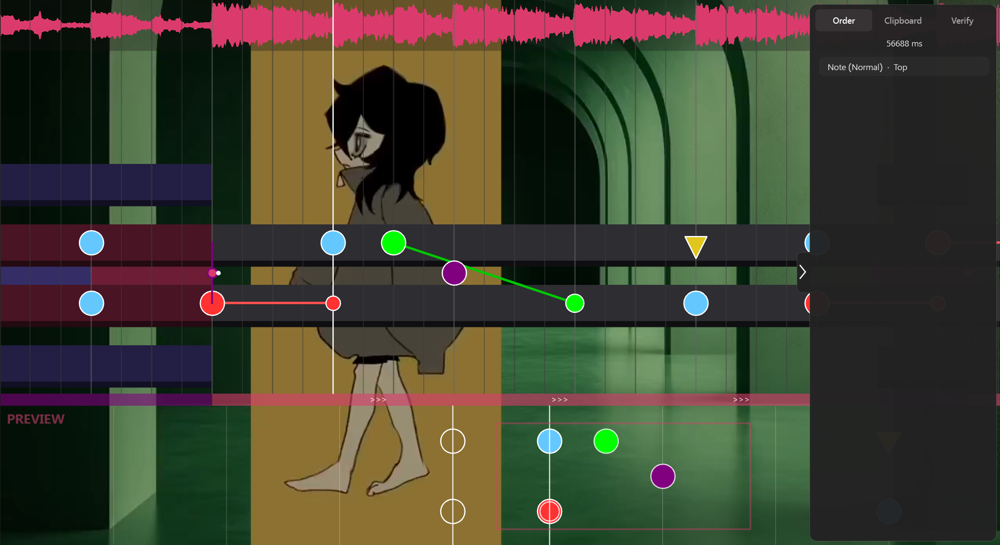
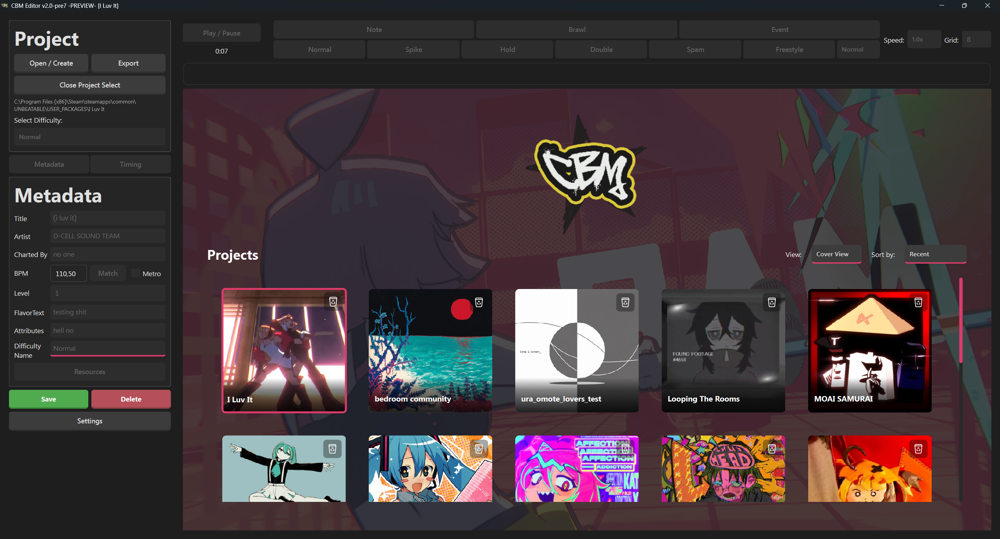
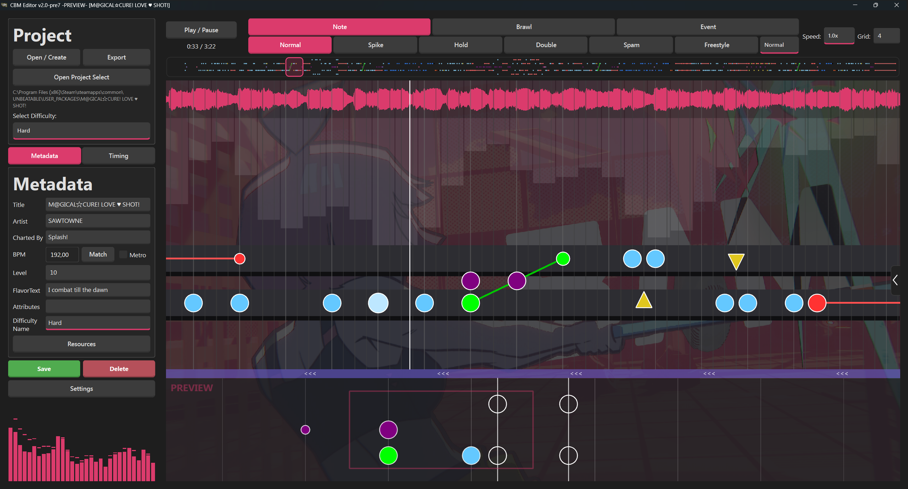
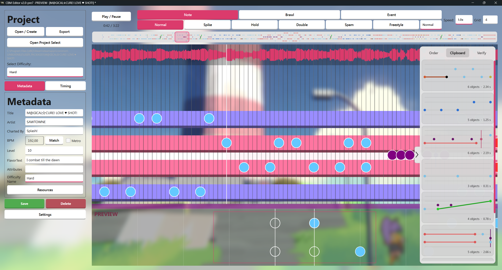
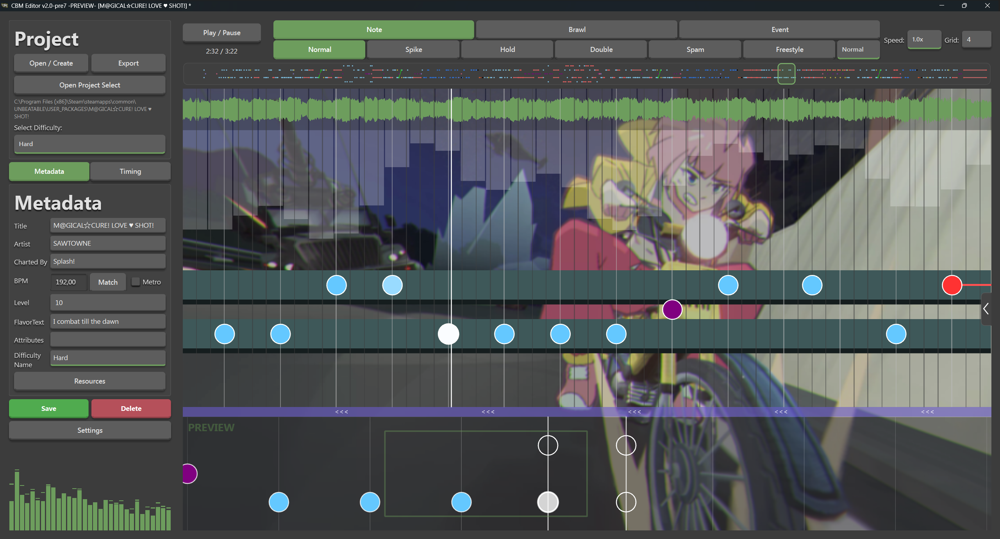

  

<h1 align="center">CBM Editor</h1>

  <strong>A highly customizable beatmap editor made for UNBEATABLE.</strong>

  <a href="https://splash02.github.io/CBM-Editor/">Website</a>
  ·
  <a href="https://github.com/Splash02/CBM-Editor/releases/latest">Latest release</a>
  ·
  <a href="https://discord.com/invite/XzqMhRMmhC">Modding Discord</a>

  <a href="#download">Download</a> ·
  <a href="#features">Features</a> ·
  <a href="#getting-started">Getting started</a> ·
  <a href="#controls--hotkeys">Controls & hotkeys</a> ·
  <a href="#screenshots">Screenshots</a>

  

## Download

> [!TIP]
> **“What is a GitHub? Just take me to the download.”**
>
> **[Download CBM Editor →](https://github.com/Splash02/CBM-Editor/releases/latest)**

| Platform | Current public build | Download |
|:--|:--|:--|
| Windows | v1.2 · standalone `.exe` | **[Direct download](https://github.com/Splash02/CBM-Editor/releases/download/1.2/CBM_Editor_v1.2.exe)** |
| Linux | Not included in the v1.2 release | [Check current releases](https://github.com/Splash02/CBM-Editor/releases/latest) |
| Any platform | Previous and future versions | [View all releases](https://github.com/Splash02/CBM-Editor/releases) |

> [!IMPORTANT]
> Installing [CustomBeatmapsV5](https://github.com/unbeatable-modding/CustomBeatmapsV5) is recommended. Starting with UNBEATABLE patch 1.9, the editor can also be used without the mod.

## Features

- Built specifically around the UNBEATABLE custom beatmap workflow.
- Note, brawl and event charting tools with configurable execution order.
- BPM matching, playback speed controls and audio-to-beat synchronization.
- In-editor preview for checking timing and lane placement.
- Undo, redo, copy, paste, multi-selection and box selection.
- Custom colors, backgrounds, visibility, grids, sounds and audio visualizer settings.
- Clean project setup for metadata, audio, cover art and other resources.
- Direct export from the editor when the chart is ready.

## Getting started

1. Select **Open / Create Project**.
2. Choose an existing project folder, or create and select a new folder for the chart.
3. Add the song title, artist, charter name, difficulty and other metadata.
4. Add the audio, cover art and any other resources used by the project.
5. Match the BPM and offset, then synchronize the timeline with the song.
6. Place notes, brawls and events, preview the result and export the finished beatmap.

## Controls & hotkeys

<strong>Timeline & playback</strong>

| Input | Action |
|:--|:--|
| <kbd>Space</kbd> | Play or pause |
| <kbd>Shift</kbd> or <kbd>Shift</kbd> + <kbd>Space</kbd> | Stop and reset the timeline |
| Mouse wheel | Move along the timeline |
| <kbd>Shift</kbd> + mouse wheel | Move along the timeline faster |
| <kbd>Ctrl</kbd> + mouse wheel | Zoom the timeline |
| <kbd>T</kbd> | Toggle triplet mode |

<strong>Tools & placement</strong>

| Input | Action |
|:--|:--|
| <kbd>Ctrl</kbd> + <kbd>1</kbd> | Select the Note tool |
| <kbd>Ctrl</kbd> + <kbd>2</kbd> | Select the Brawl tool |
| <kbd>Ctrl</kbd> + <kbd>3</kbd> | Select the Event tool |
| <kbd>1</kbd>–<kbd>6</kbd> | Select a type within the active tool |
| Left click on empty space | Place the selected object |
| Right click an object | Delete it |
| <kbd>Delete</kbd> or <kbd>Backspace</kbd> | Delete all selected objects |
| Mouse wheel over a numeric field | Change its value |

<strong>Selection & object editing</strong>

| Input | Action |
|:--|:--|
| <kbd>Shift</kbd> + left click | Add an object to the selection |
| Drag outside the lane area | Box-select objects |
| Click and drag a selected object | Move the selection |
| Drag the tail of a hold | Resize the hold |
| <kbd>Ctrl</kbd> + left click an object | Cycle its relevant variant or property |
| <kbd>Ctrl</kbd> + right click an event or spike | Change its execution order when it shares a timestamp with a note |
| <kbd>Ctrl</kbd> + <kbd>A</kbd> | Select all objects |
| <kbd>Ctrl</kbd> + <kbd>C</kbd> | Copy the selection |
| <kbd>Ctrl</kbd> + <kbd>V</kbd> | Paste copied objects |

<strong>Project & history</strong>

| Input | Action |
|:--|:--|
| <kbd>Ctrl</kbd> + <kbd>S</kbd> | Save the current project |
| <kbd>Ctrl</kbd> + <kbd>Z</kbd> | Undo; hold to repeat |
| <kbd>Ctrl</kbd> + <kbd>Y</kbd> | Redo; hold to repeat |
| <kbd>Ctrl</kbd> + <kbd>Shift</kbd> + <kbd>Z</kbd> | Redo |

## Screenshots

  

<table>
  <tr>
    <td width="50%"></td>
    <td width="50%"></td>
  </tr>
  <tr>
    <td colspan="2"></td>
  </tr>
</table>

## Questions and modding

For questions about setup, charts, file formats, modding or something that broke, join the [UNBEATABLE Modding Discord](https://discord.com/invite/XzqMhRMmhC).

CBM Editor is a fan-made project. It is not affiliated with or endorsed by D-CELL GAMES or Playstack.
